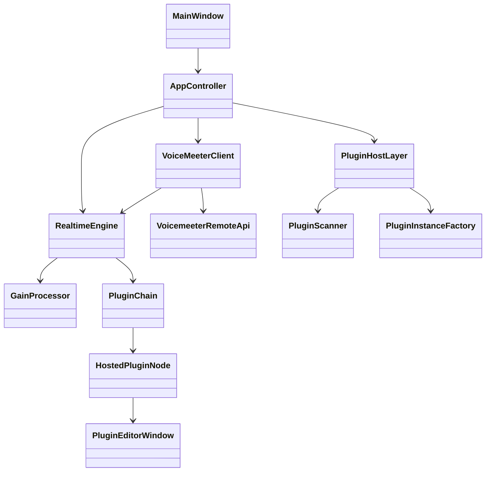

# Architecture Proposal

## Goal

Build a Windows application that inserts directly into VoiceMeeter's audio path
using the VoiceMeeter Remote Audio Callback API.

The target signal flow is:

```text
VoiceMeeter -> Elka VoiceMeeter FX Host -> VoiceMeeter
```

This avoids external ASIO Insert routing through Cantabile, LightHost,
Minihost, Element, Pedalboard, and similar hosts.

## First Principle

VoiceMeeter is the audio device and clock owner. The app is a callback processor
inside that stream. JUCE should be used later for plugin hosting, scanning,
plugin editors, state management, and UI, but the first prototype should verify
the VoiceMeeter callback path without VST complexity.

## Layers



## Core Engine

Responsible for real-time audio processing and callback statistics.

Current prototype:

- Per-channel atomic gain parameters.
- Per-channel atomic delay parameters.
- Per-channel atomic enable/bypass parameters.
- Atomic selected source-group range.
- No allocations inside the callback.
- No file I/O, logging, UI, or locks inside the callback.
- Interprets VoiceMeeter input/output/main callback buffer layouts.

Future:

- Plugin chain processing.
- Latency reporting.
- Delay compensation strategy.
- Offline-free, real-time-only processing mode.

## VoiceMeeter Integration Layer

Responsible for:

- Finding the installed VoiceMeeter Remote DLL.
- Loading the correct 32-bit or 64-bit DLL.
- Calling `VBVMR_Login()` and `VBVMR_Logout()`.
- Registering one callback mode at a time.
- Starting/stopping callback processing.
- Passing callback buffers to the core engine.

## Plugin Host Layer

Use JUCE hosting classes where possible:

- `juce::AudioPluginFormatManager`
- `juce::KnownPluginList`
- `juce::PluginDirectoryScanner`
- `juce::AudioPluginInstance`
- `juce::AudioProcessorGraph`
- `juce::AudioProcessorEditor`

LightHost is useful as an architectural reference because it demonstrates a
simple JUCE `AudioProcessorGraph` chain and plugin editor windows. It should not
be used as the starting point for this project.

Current implementation:

- JUCE is optional and expected at `external/JUCE`.
- If JUCE is present, the app builds a VST3 discovery layer using
  `juce::AudioPluginFormatManager`, `juce::KnownPluginList`, and
  `juce::PluginDirectoryScanner`.
- Discovery runs from the UI thread for the prototype and does not touch the
  VoiceMeeter callback thread.
- Audio processing through VST plugins is not enabled yet.

## UI Layer

Phase 1 uses a native Win32 UI so the VoiceMeeter callback can be verified
without external dependencies. The design leaves the engine isolated so a JUCE
UI can replace or wrap it later.

Required first controls:

- Connection status.
- Callback mode selector.
- Enable/disable processing.
- Source/group selector.
- Visible per-channel delay and gain strip bank.
- Link faders control.
- Start/stop callback.
- Sample rate, block size, channel count, callback CPU, and latency display.

## Routing Layer

Routing is intentionally a separate future layer. VoiceMeeter buffers are
channel-separated float pointers, so routing should be modeled explicitly as a
read-channel/write-channel map.

Future routing features:

- Multiple simultaneous input channel maps.
- Multiple simultaneous output channel maps.
- Mono to stereo.
- Stereo to mono.
- Multichannel plugin handling.
- Per-strip or per-bus processing chains.

Current routing foundation:

- Input Insert exposes named source groups: Strip 1-5, Virtual Input 1,
  Virtual AUX, and Virtual VAIO 3.
- Output Insert and Main expose named bus groups A1-A5/B1-B3.
- Selecting a source group opens two visible channel lanes for stereo strips or
  eight visible channel lanes for virtual inputs and busses.
- Each lane has a delay strip on the left and gain fader on the right.
- Delay range is `0-10000 ms`.
- The `Link faders` control lets one moved strip/fader update every channel in
  the selected group together.
- Untargeted channels are passed through unchanged.
- Selecting a group changes what the controls edit; previously configured
  channels keep processing.

This keeps both workflows available:

- Group processing: one chain across a stereo strip, virtual input block, or bus.
- Mono processing: one chain on a single channel, such as only left or right.

Future node editor direction:

- VoiceMeeter targets become input/output pins.
- Plugin chains become graph nodes.
- Dragging from a channel pin to a plugin input creates a processing edge.
- Dragging from the plugin output to a channel pin creates the return edge.
- The current per-channel settings bank is the first lightweight version of
  that lane model.

## Persistence Layer

Future settings:

- Plugin scan paths.
- Plugin blacklist.
- Active chains.
- Plugin state blobs.
- Window positions.
- Callback mode.
- Routing maps.
